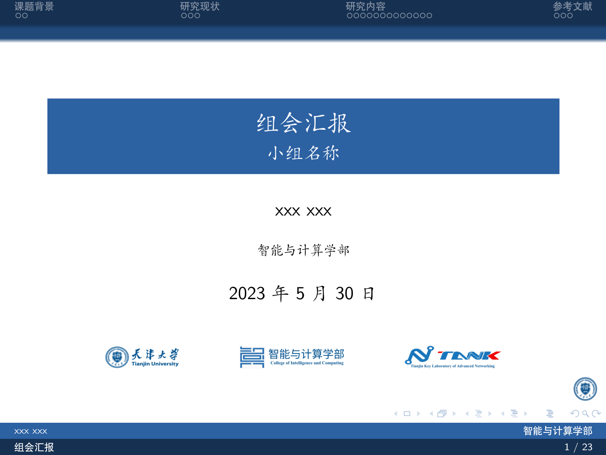

# TJU Beamer Template

* 参考[中科大](https://www.overleaf.com/latex/templates/ucas-beamer-theme/npkdpbrpjfbn)改
* AUR 相关包
    ```
    texlive-bibtexextra 2023.66579-1
    texlive-bin 2023.66539-1
    texlive-core 2023.66587-2
    texlive-fontsextra 2023.66328-1
    texlive-langchinese 2023.66188-1
    texlive-latexextra 2023.66551-1
    texlive-pgfgantt 5.0-1
    texlive-pictures 2023.66549-1
    texlive-pstricks 2023.66115-1
    texlive-science 2023.66461-1
    ```
* Example

* Files
    ```
    .
    ├── clean.sh        : Hand-made Cleaner
    ├── img             : Images in README.md
    ├── Makefile        : Commands for building the project
    ├── pic             : Figures for sides
    ├── README.md       
    ├── ref.bib         : Reference
    ├── ref.buk         : Reference Style Definition
    ├── slide.pdf       : Output Sides
    ├── slide.tex       : Slide source code
    └── TJU.sty         : Hand-made styles
    
    3 directories, 14 files
    ```
* Commands
    ```bash
    make        # quick build
    make build  # build with .bib and others
    make clean  # cleanup using clean.sh
    ```
